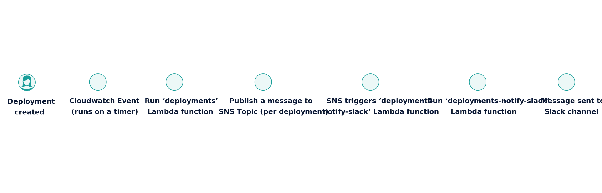

# Outsystems deployment notifications to Slack

This project is a work in progress, sending notifications to a Slack channel when a new deployment occurs in Outsystems.

There's two parts,  a `deployments` lambda function which checks for new deployments and a `deployments-notify-slack` lambda function which sends a message to Slack.

_Caveat_: Yes there's a whole heap of chaining of promises and alike and the code needs refactoring. Not proud but we'll rework it in time!

### Example flow


## Development

### Depedencies

This project uses [node-lambda](https://www.npmjs.com/package/node-lambda) to run serverless lambda functions locally and deploy them to AWS.

You'll need to install [node-lambda](https://www.npmjs.com/package/node-lambda) to develop locally, run and deploy.

You'll also need an AWS account, or access to credentials that let you create a dynamodb table and Lambda functions.

### Configuration

1. Go to AWS
2. Create an IAM user (you'll need the Access ID and Secret Key for that user)
3. Create an IAM role (you'll need the role ARN for that role)
4. Create a dynamodb table with a primary key of `id` (you'll need to keep a note of the name of the table)
5. Create an SNS topic for your notifications to be sent to (you'll need to keep a note of the ARN of the SNS topic)
6. Go into your Slack team and add an 'Incoming WebHook' integration to a Channel of your choice (you'll need the webhook url)
7. [Create a a Service Account](https://success.outsystems.com/Documentation/10/Reference/OutSystems_APIs/LifeTime_Deployment_API/REST_API_Authentication#Creating_a_service_account) in Outsystems Lifetime (you'll need the auth key for the Service Account)

You'll need a few credentials for the functions to work, all of these are described in each `.env.sample` file.

You need to replace these values with your own for the functions to run.

## Deployment

Deployment has been made pretty simple for the time being. You'll need a `deploy.env` file that describes the environment variables required by each Lambda function. There's a sample `deploy.env.sample` file for you to configure.

Once configured, you can deploy each function by running: 

```
node-lambda deploy -e production -f deploy.env
```

### Once you've deployed both functions
1. Add a subscription to your SNS topic to run the `deployments-notify-slack` lambda function
2. Configure a CloudWatch Event timer to run the `deployments` function as frequently as you need. We advise starting with every 15 minutes.